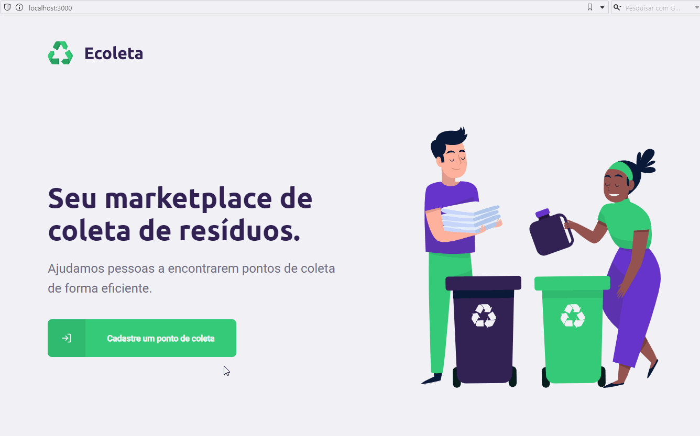
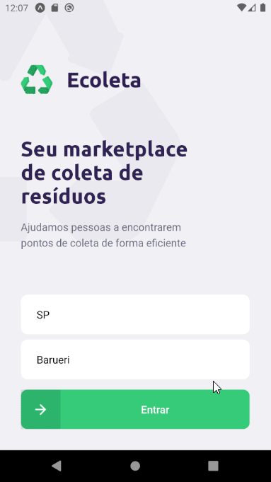

<h1 align="center">
  Next Level Week #01
</h1>

<p align="center">
  <a href="#project">Project</a>   |   
  <a href="#built-with">Built With</a>   |   
  <a href="#installation">Installation</a>   |   
  <a href="#deployment">Deployment</a>   |   
  <a href="#license">License</a>
</p>

<br>

# Project

O projeto Ecoleta foi desenvolvido durante a Next Level Week 01 (NLW#1) da Rocketseat (Junho/2020).

O e-Coleta funciona como um marketpalce onde estabelecimentos, apelidados de pontos de coleta, podem se oferecer como ponto de depósito para determinados itens como Óleo, Pilhas, Lixo, etc. Para isso os estabelecimentos se cadastram em um portal web dizendo quais itens pode coletar, e o público através de um aplicativo mobile busca no mapa os pontos de coleta próximos de acordo com os itens que deseja descartar. Depois disso o usuário pode entrar em contato através de e-mail ou Whatsapp.

Funcionalidades Extras:

- Web:
  - Tela de conclusão com animação
  - Integração com API do IBGE
  - Validação de campos
  - Tratamento de erros durante o cadastro

<br>

## Frontend



<br>

## Mobile

<!--- --->



<br>

# Built With

Este projeto foi desenvolvido em Typescript com as seguintes tecnologias:

Backend:

- [Node](https://nodejs.org/en/)
- [Insomnia](https://insomnia.rest/download/)
- [Express](https://www.npmjs.com/package/express)
- [Knex](http://knexjs.org/)
- [SQLite3](https://www.npmjs.com/package/sqlite3)
- [multer](https://www.npmjs.com/package/multer)
- [celebrate](https://github.com/arb/celebrate)

Frontend:

- [React JS](https://reactjs.org/)
- [react-icons](https://react-icons.github.io/react-icons/)
- [react-navigation](https://reactnavigation.org/docs/getting-started)
- [react-leaflet](https://react-leaflet.js.org)
- [axios](https://www.npmjs.com/package/axios)
- [API IBGE](https://servicodados.ibge.gov.br/api/v1)
- [react-dropzone](https://servicodados.ibge.gov.br/api/v1)
- [react-lottie](https://github.com/chenqingspring/react-lottie)

Mobile:

- [React Native](https://facebook.github.io/react-native/)
- [Expo](https://expo.io/)
- [expo-google-fonts](https://dev.to/expo/expo-google-fonts-is-released-4g58)
- [react-navigation](https://reactnavigation.org/docs/getting-started)
- [react-native-maps](https://www.npmjs.com/package/react-native-maps)
- [react-native-svg](https://www.npmjs.com/package/react-native-svg)
- [axios](https://www.npmjs.com/package/axios)
- [expo-location](https://www.npmjs.com/package/expo-location)
- [expo-mail-composer](https://www.npmjs.com/package/expo-mail-composer)

<br>

# Installation

## Requirements

- Node

- NPM

- Expo-cli

  ```
  npm global add install expo-cli
  ```

<br>

## Installation Steps

- Clone this repository

  ```
  git clone https://github.com/renanxr3/nlw01
  ```

- Install Backend dependencies

  ```
  cd backend
  npm install
  ```

- Create database

  ```
  npm knex migrate:latest
  ```

- Install web dependencies

  ```
  cd web
  npm install
  ```

- Install mobile dependencies

  ```
  cd mobile
  npm install
  ```

<br>

# Deployment

## Backend

```
cd omnistack11-backend
npm run dev
```

## Web

```
cd web
npm start
```

## Mobile

```
cd omnistack11-mobile
npm start
```

<br/>

# Authors

- [Renan Santos](https://github.com/renanxr3)

<br/>

# License

This project is licensed under the [MIT License](LICENSE.md).

<br/>

# Acknowledgments

- [Rocketseat](https://rocketseat.com.br/)
- [Next Level Week #1](https://nextlevelweek.com/)
